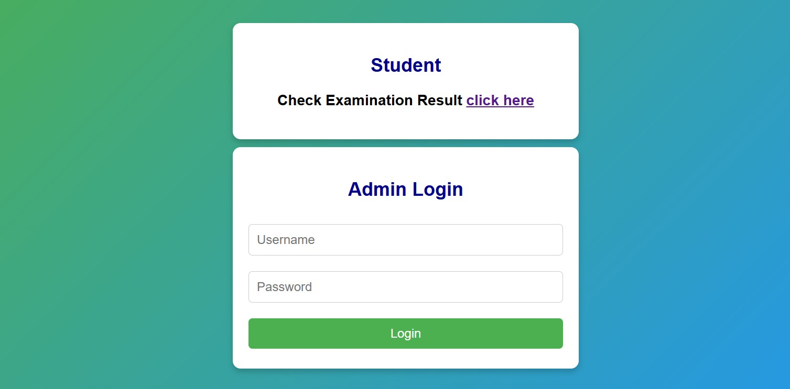
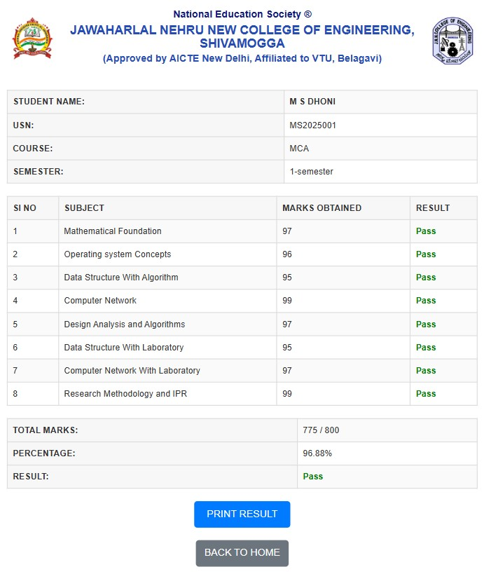

🎓 Student Result Management System

A web-based application is developed and simplify the process of managing and viewing student results in educational institutions.

## 🚀 Features

- **Admin Panel**  
  - Add/update student details  
  - Enter and manage student results  
  - Automated total, percentage, and grade calculation  

- **Student Login**  
  - Secure login to view individual results  

- **Data Management**  
  - MySQL database integration for storing student records and results  

- **User Roles**  
  - Admin and Student access with role-based permissions  

- **Responsive UI**  
  - Works smoothly on desktop, tablet, and mobile devices  

## 🛠️ Tech Stack

- **Frontend:** HTML5, CSS3, Bootstrap 5, JavaScript  
- **Backend:** PHP  
- **Database:** MySQL  

## 🔐 Security

- Secure login system for both Admin and Students  
- Role-based access control    

## 📷 Screenshots

### 🔐 Login Page


## 🧾 Result Page Screenshot


## 📁 Setup Instructions

1. Clone the repository:
   ```bash
   git clone https://github.com/ArunNShet/Student-Result-Management-System.git
